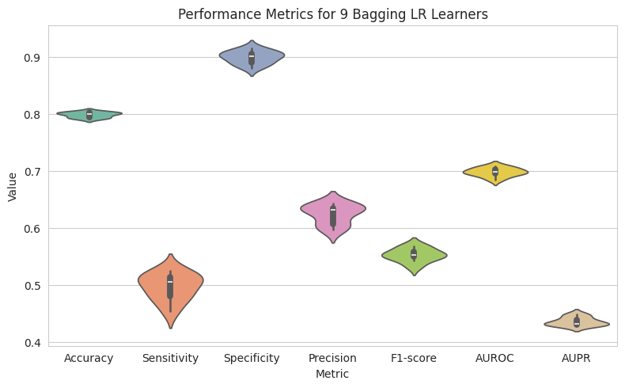
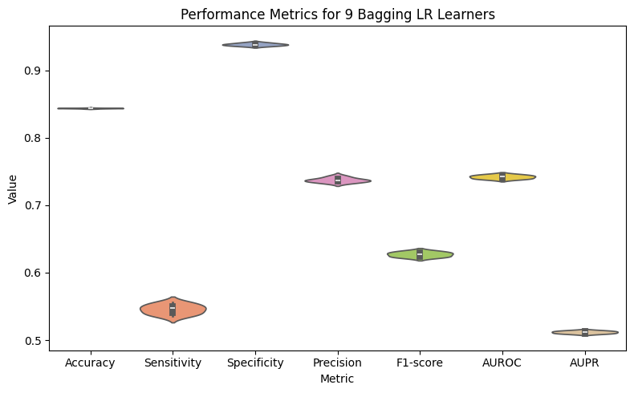
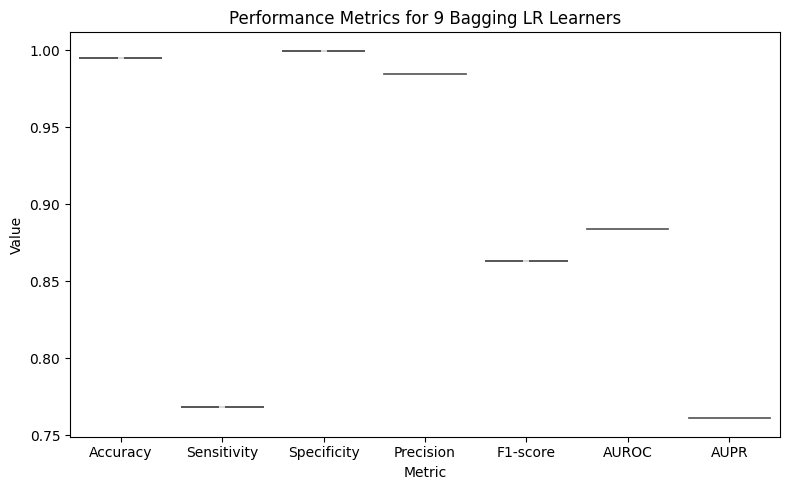

# Assignment 2: Logistic Regression with Bagging and Stacking

190066 - Abir Muhtasim


In the notebook, there are three sub-sections under ***Dataset Preprocessing*** named ***Dataset 1***, ***Dataset 2*** and ***Dataset 3***. Uncomment the section before running the code for the respective dataset and set the ***DATASET_PATH*** and ***LABEL_COLUMN_NAME*** accordingly.


## Dataset - 1 : Telco

**Performance on test set**

| | Accuracy | Sensitivity | Specificity | Precision | F1-score | AUROC | AUPR |
|---|---|---|---|---|---|---|---|
LR | 0.7982 ± 0.0038 |0.4959 ± 0.0204 |0.8992 ± 0.0077 |0.6223 ± 0.0118 |0.5516 ± 0.0118 |0.6976 ± 0.0076 |0.4348 ± 0.0080 |
Voting ensemble | 0.8000 |0.4972 |0.9012 |0.6272 |0.5547 |0.6992 |0.4378 |
Stacking ensemble | 0.8007 |0.5568 |0.8822 |0.6125 |0.5833 |0.7195 |0.4521 |

**Hyperparameters**

```
BASE_LEARNER_REGULARIZATION = 'l1'
BASE_LEARNER_LAMBDA_PARAM = 0.005
BASE_LEARNER_MAX_ITER = 1000
BASE_LEARNER_LEARNING_RATE = 0.1
```

**Voilin plot**




---


## Dataset - 2 : Adult

**Performance on test set**

| | Accuracy | Sensitivity | Specificity | Precision | F1-score | AUROC | AUPR |
|---|---|---|---|---|---|---|---|
LR | 0.8437 ± 0.0004 |0.5457 ± 0.0067 |0.9383 ± 0.0017 |0.7373 ± 0.0032 |0.6272 ± 0.0033 |0.7420 ± 0.0025 |0.5118 ± 0.0017 |
Voting ensemble | 0.8441 |0.5448 |0.9391 |0.7397 |0.6275 |0.7420 |0.5127 |
Stacking ensemble | 0.8440 |0.5475 |0.9381 |0.7375 |0.6285 |0.7428 |0.5128 |

**Hyperparameters**
```
BASE_LEARNER_REGULARIZATION = 'l1'
BASE_LEARNER_LAMBDA_PARAM = 0.005
BASE_LEARNER_MAX_ITER = 1000
BASE_LEARNER_LEARNING_RATE = 0.8
TOP_K = 20
```

**Voilin plot**




---

## Dataset - 3 : Credit Card Fraud Detection

**Performance on test set**

| | Accuracy | Sensitivity | Specificity | Precision | F1-score | AUROC | AUPR |
|---|---|---|---|---|---|---|---|
LR | 0.9951 ± 0.0000 |0.7683 ± 0.0000 |0.9998 ± 0.0000 |0.9844 ± 0.0000 |0.8630 ± 0.0000 |0.8840 ± 0.0000 |0.7609 ± 0.0000 |
Voting ensemble | 0.9951 |0.7683 |0.9998 |0.9844 |0.8630 |0.8840 |0.7609 |
Stacking ensemble | 0.9956 |0.7805 |1.0000 |1.0000 |0.8767 |0.8902 |0.7849 |

**Hyperparameters**
```
BASE_LEARNER_REGULARIZATION = 'l2'
BASE_LEARNER_LAMBDA_PARAM = 0.05
BASE_LEARNER_MAX_ITER = 3000
BASE_LEARNER_LEARNING_RATE = 0.8
```

**Voilin plot**


