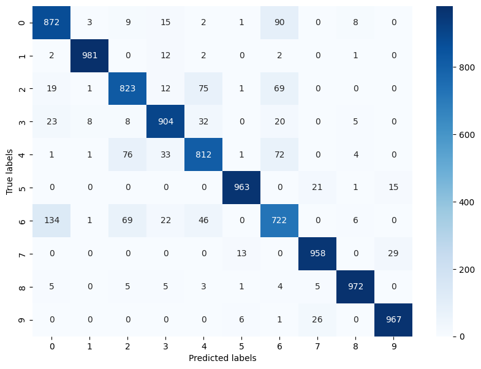

# Offline-3 : FNN
Abir Muhtasim - 1905066


## Architecture - 1

```python
model = NeuralNetwork()
model.add_layer(DenseLayer(28*28, 512))
model.add_batch_normalization()
model.add_layer(ReLU())
model.add_dropout(0.5)

model.add_dense_layer(128)
model.add_batch_normalization()
model.add_layer(ReLU())
model.add_dropout(0.8)

model.add_dense_layer(10)
model.add_batch_normalization()
model.add_layer(Softmax())
```

### Learning Rate: 0.005
- **Test Accuracy: 0.8846**
- **Test f1_score: 0.8844**


### Learning Rate: 0.001
- **Test Accuracy: 0.8952**
- **Test f1_score: 0.8946**


### Learning Rate: 0.0005
- **Test Accuracy: 0.8959**
- **Test f1_score: 0.8952**


### Learning Rate: 0.0001
- **Test Accuracy: 0.8990**
- **Test f1_score: 0.8987**


---


## Architecture - 2

```python
model = NeuralNetwork()
model.add_layer(DenseLayer(28*28, 512))
model.add_batch_normalization()
model.add_layer(ReLU())
model.add_dropout(0.5)

model.add_dense_layer(256)
model.add_batch_normalization()
model.add_layer(ReLU())
model.add_dropout(0.6)

model.add_dense_layer(128)
model.add_batch_normalization()
model.add_layer(ReLU())
model.add_dropout(0.8)

model.add_dense_layer(10)
model.add_batch_normalization()
model.add_layer(Softmax())
```

### Learning Rate: 0.005
- **Test Accuracy: 0.8858**
- **Test f1_score: 0.8853**


### Learning Rate: 0.001
- **Test Accuracy: 0.8939**
- **Test f1_score: 0.8946**


### Learning Rate: 0.0005
- **Test Accuracy: 0.8974**
- **Test f1_score: 0.8973**





## Architecture - 3

```python
model = NeuralNetwork()
model.add_layer(DenseLayer(28*28, 512))
model.add_batch_normalization()
model.add_layer(ReLU())
model.add_dropout(0.5)

model.add_dense_layer(256)
model.add_batch_normalization()
model.add_layer(ReLU())
model.add_dropout(0.6)

model.add_dense_layer(128)
model.add_batch_normalization()
model.add_layer(ReLU())
model.add_dropout(0.8)

model.add_dense_layer(10)
model.add_batch_normalization()
model.add_layer(Softmax())
```

### Learning Rate: 0.005
- **Test Accuracy: 0.8856**
- **Test f1_score: 0.8857**


### Learning Rate: 0.001
- **Test Accuracy: 0.8937**
- **Test f1_score: 0.8933**


### Learning Rate: 0.0005
- **Test Accuracy: 0.8945**
- **Test f1_score: 0.8944**


### Learning Rate: 0.0001
- **Test Accuracy: 0.8960**
- **Test f1_score: 0.8958**


