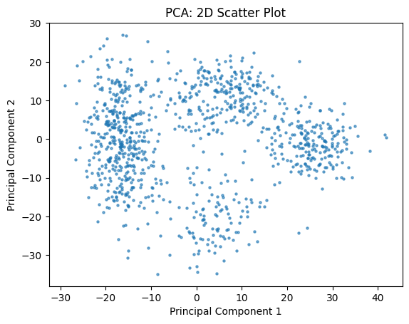
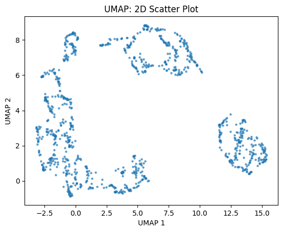
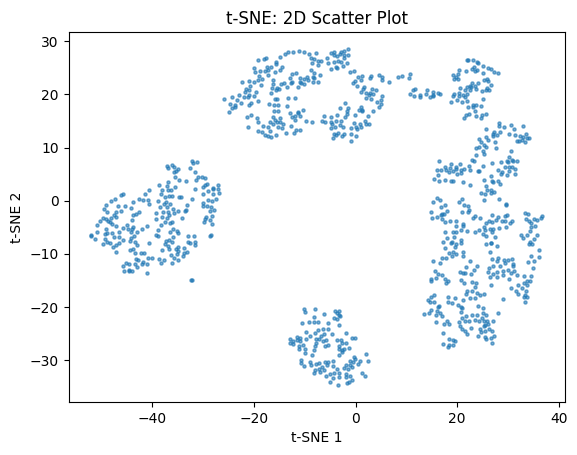

# Assignment 4: Principal component analysis (PCA) and expectation-maximization (EM) algorithm

1905066 - Abir Muhtasim

## Task - 1 : PCA








***How to run***

Set the dataset path
```python
data = np.loadtxt('path/to/data')
```

*Need numpy version 2.0 for umap-learn library*


## Task - 2 : EM Algorithm

```
Mean children with family planning: 1.7893097099558297
Mean children without family planning: 4.9165784861760615
Proportion family planning: 0.35800520079672793
Proportion without family planning: 0.6419947992032721
```

***How to run***

Set the dataset path
```python
data = np.loadtxt('path/to/data')
```